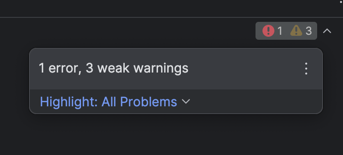
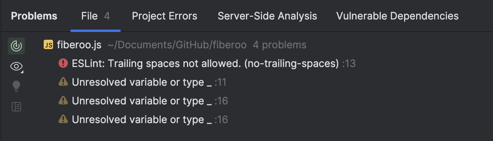

### Consistency is Key
When learning about software engineering, developers of all skill levels most likely have encountered documentation for coding standards: a set of guidelines that establish how a programming language should be written in terms of style and structure. These standards define practices such as indentation, spacing, naming conventions, commenting format, etc. While it seems like these are merely for aesthetic purposes, coding standards play a significant role in the creation of clean, efficient code. Developers are encouraged to adhere to these standards in order to promote consistency and readability across various platforms. With code structured in a uniform manner, it also becomes easier for other developers to collaborate and maintain a codebase overtime. 

### IntelliJ and ESLint
Throughout the different computer science courses I have taken, I have used a variety of integrated development environments (IDEs), online code editors, and good ol' text editors. Some felt modern, yet a bit overwhelming (looking at VSCode and its many plugins), while others felt tedious to use (such as Emacs and its strict navigation through the arrow keys). In ICS 314, I have been introduced to IntelliJ and the tool ESLint. It is my first time using both, and I think I quite like this pair. I have heard mostly positive opinions on IntelliJ in general discussions of "What's your favorite IDE?," though I did not know what to expect jumping into it. After a quick walkthrough, I learned that it comes with neat features such as plugins, code completion, a "problems" tool window, and even its own AI assistant! As someone new to coding and also prone to making many mistakes, these features will save me from the stress of figuring out where my code went wrong.

With ESLint, it displays the severity of an issue in two ways:
- Yellow squiggly lines serve as warnings. Sometimes, they do not have to be fixed, but it is probably best if you did.
- Red squiggly lines indicate an error that must be fixed, or your code will not run properly.

  

These issues also appear in the "problems" tool window that I have previously mentioned.

  

Additionally, if you absolutely do not know how to proceed after seeing either a yellow or red squiggly line, ESLint provides a description of the error and a solution available at the click of a button. I find this feature useful, as I can spend less time redoing parts of my code and more time on improving it.

When your code is finally error-free, ESLint displays a small green checkmark on the top right of the code window. It brings a sense of relief and satisfaction when I see it, since at that point, I know I have made progress with my code. Although it has only been a week of using IntelliJ and ESLint, I find myself implementing the coding standards and the associated practices more and more. I tend to be inconsistent on where I put spaces before parenthesis or curly braces, and also how often I make a new line under an existing line of code. ESLint picks up on these bad habits, and in turn, I *have* to correct them. 

### Blueprint for Success
Overall, I see myself using these tools for as long as I can. The error and warning messages may be critical at times, but I will view them as learning opportunities. I am nowhere near my desired proficiency in coding, so being able to see and understand why my code may not be optimal will help me improve. 
