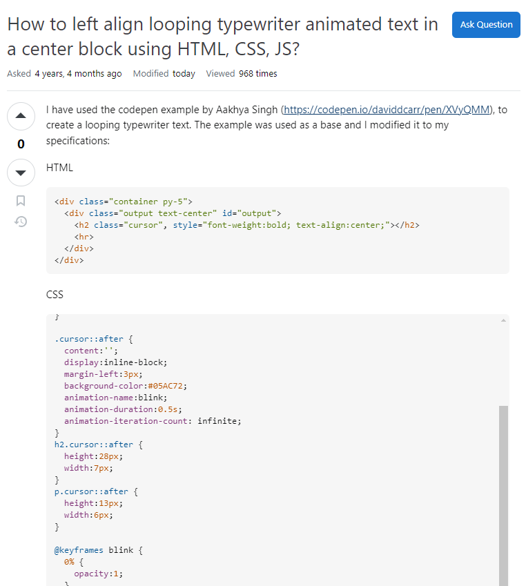
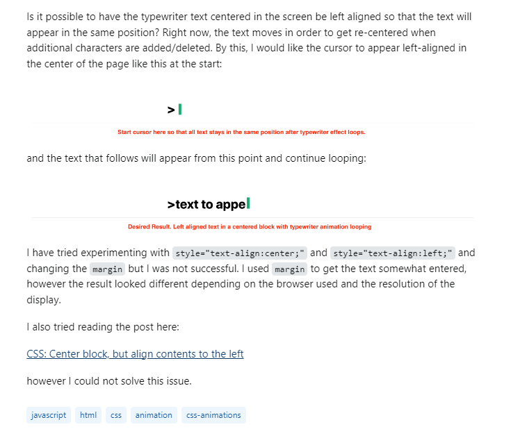

&nbsp;  

### The Recipe for Success
Eric Steven Raymond's essay, [How to Ask Questions the Smart Way](http://www.catb.org/esr/faqs/smart-questions.html), serves as a guide in understanding the principles behind smart questions and how to properly ask them on online forums, such as StackOverflow. In essence, smart questions are those that are thoughtfully presented; they are clearly written, detailed (yet concise), and describe the steps leading up to the issue. Raymond emphasizes conducting prior research before seeking assistance through the means of consulting documentation, performing Google searches, or browsing multiple online forums for a question similar to yours. He also places an emphasis on humility and respect in interactions between fellow developers, as these are real people volunteering their time to assist others.

 

### Examining the Smart and Not-So-Smart Questions
[Here](https://stackoverflow.com/questions/58052144/how-to-left-align-looping-typewriter-animated-text-in-a-center-block-using-html) is what I consider a smart question. From the post, I am able to gather that the user wishes to align their animated text to the left, while remaining in the center block. They have provided their HTML, CSS, and JavaScript code, along with visual examples of what the code is currently producing and what their end goal is. The user also mentions that they have read another StackOverflow post regarding a similar issue and tried to modify certain parts of their code to no avail. Although the respondents' solutions seemed like a quick and simple fix, the user displayed effort and willingness to learn in their post, thus making this a good example of a smart question.

  
    

[Here](https://stackoverflow.com/questions/77884912/pagination-using-dom-gives-assertion-error) is what I consider a not-so-smart question. Despite not being too versed in some of the jargon used in this post, it was not very clear to me what exactly the problem was. The user did not provide their code, and the description of their issue should have been in a more readable format. The post was quite vague in general, which won't be a useful search result for those who may encounter this post in the future. This inevitably led to the respondents asking for more information, and you know your question needs improvement when someone links an article called ["How to Ask a Good Question."](https://stackoverflow.com/help/how-to-ask) In the end, the post was closed and is awaiting user edits.

  

### Smart Questions, Smarter Solutions
Overall, Raymond's essay has given me much insight on what it means to ask a smart question. As a student, I will often reach for sites such as StackOverflow, and of course, all other resources that are immediately available to me. While tools such as ChatGPT exist, I believe the guidance you receive from human developers can be far more valuable. I tend to do more searching rather than asking myself, but I'll be able to properly craft a smart question for next time, and hopefully I'll receive a smart answer in return. Ultimately, asking smart questions is more than just seeking solutions; it helps foster a positive and collaborative environment where developers can learn from each other's experiences. 

(ChatGPT was used to brainstorm essay and header titles, along with guiding essay direction.)
