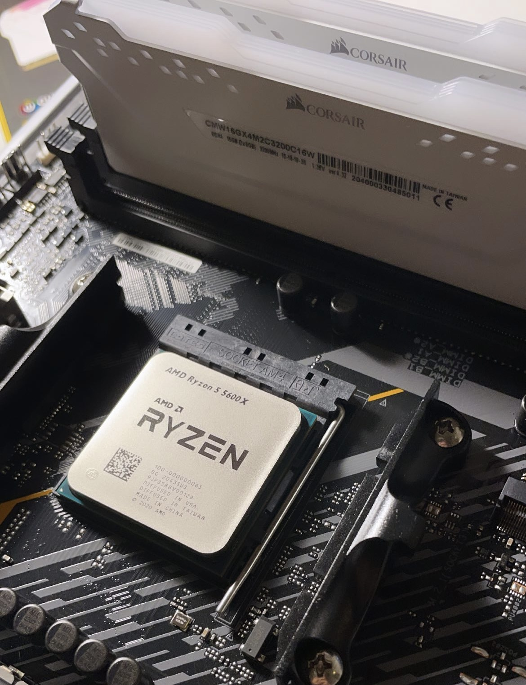

Building my first PC was a time-consuming, yet rewarding, experience. For several years, I spent most of my time browsing the internet, doing homework, and playing video games on a laptop. Because they can be limited in performance and upgradability, I decided that having a desktop would be the best option for long-term use. I had two choices: buying a prebuilt computer or building it from scratch. I could've taken the easy, and perhaps more convenient, route of buying a prebuilt. Though, since I haven't built a PC before, I figured, "Why not?" I have heard of the process being described as putting together LEGO pieces, so how difficult can it be?

I started this project by researching the different parts, such as the GPU, CPU, RAM, etc. I wanted a system that could be sufficient for both school and gaming. I watched countless YouTube videos on part comparisons, budget builds, and tutorials on how to put it all together. I also utilized a site called [PCPartPicker](https://pcpartpicker.com/), which allowed me to easily compile a list of the parts I wanted to buy. It was quite useful in many ways. It showed multiple retailers that sold the specific part, and it also told you if your selected parts were compatible or not. Once I finalized my list, I ordered the parts as soon as I could and often looked forward to delivery days.

I started the build once I had all the parts in my possession. It took around 2 days to set everything up properly, mostly due to confusion and tedious cable management. I frequently referred to the manuals and YouTube videos, and backtracked every time something didn't work. Fortunately, I didn't have any major issues, such as a part arriving broken or the PC not booting up.

Although it was a bit stressful, I thoroughly enjoyed the experience as I learned much from it. I was able to help my younger brother build his PC a few months later, and I sometimes troubleshoot the problems he might have regarding his hardware. If I had the opportunity to build another PC, I definitely would take it up.

