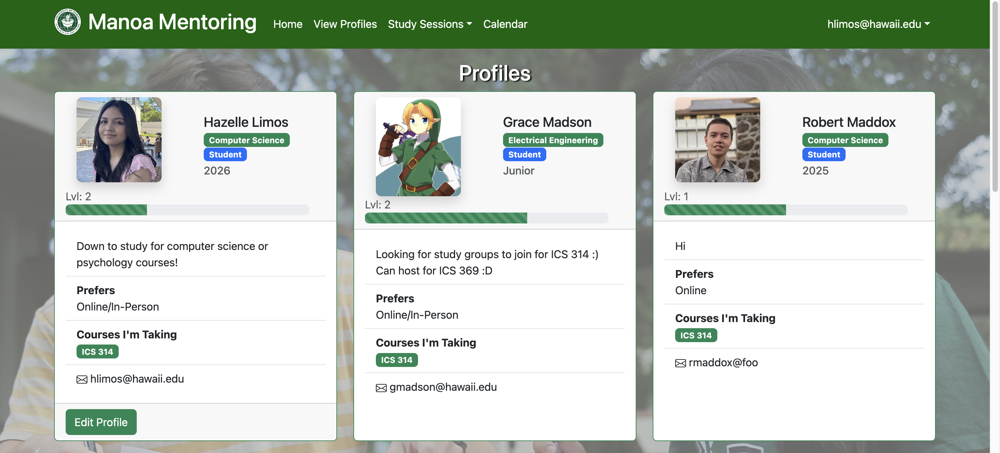
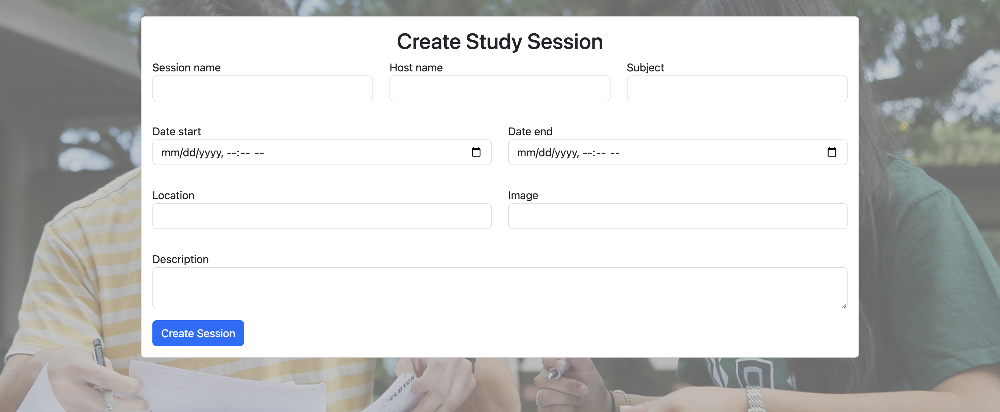
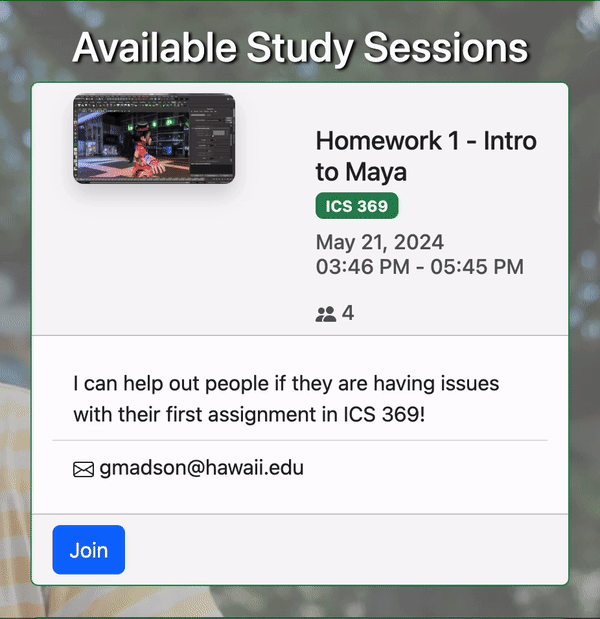

  

### Overview
This project was developed as our last assignment for ICS 314 at the University of Hawaii at Manoa. 

Manoa Mentoring is a web application that allows students to find a study buddy and organize study sessions. Users can create an account, log in, and search for other users based on their major, courses they are taking, and meetup preferences. The application also includes a calendar feature that allows users to schedule and keep track of their study sessions.

Source code can be viewed at [manoa-mentoring/manoamentoring](https://github.com/manoa-mentoring/manoamentoring).

The live website can be viewed at https://manoa-mentoring.site/.

Visit https://manoa-mentoring.github.io/ to learn more about the development process!

### My Contributions
For this project, I was responsible for creating the overall look for the user profiles, the create/edit session pages, and implementing the "join session" function. I also assisted with the page for displaying the user's joined sessions, along with other issues that arose during development. 

    
    
    

### What I Learned
This project was a great learning experience for me as it allowed me to work on a full-stack web application using the Meteor framework. I gained valuable experience in developing a responsive and user-friendly web application, as well as working with a team to meet project deadlines. I also learned how to effectively communicate with team members and collaborate on different aspects of the project. Ultimately, I feel that this project has helped me grow as a developer and has prepared me for future projects in the field of web development.